# 📊 Employee Attrition Analysis  
**데이터 기반 직원 이탈 분석 및 HR 개선 전략 제안**

---

## 1. 📍 프로젝트 개요

이 프로젝트는 조직 내 직원 이탈(Attrition)이 왜 발생하는지 데이터를 기반으로 분석하고,  
그 결과를 바탕으로 **실제 현장에서 적용할 수 있는 HR 전략을 고민해보기 위해 진행되었습니다.**

- 데이터 출처: Kaggle - HR Employee Attrition.csv  
- 사용 도구: Python (Pandas, Seaborn, Matplotlib)  
- 분석 환경: VSCode, Jupyter Notebook, GitHub  

단순히 “어디서 이탈이 많다”를 보여주는 것이 아니라,  
**왜 그런 현상이 발생하는지 이해하고, 어떻게 개선할 수 있을지까지 연결하는 데 집중했습니다.**

---

## 2. 🎯 문제 정의

직원 이탈은 단순히 사람이 나가는 문제가 아니라,  
조직 운영 전반에 영향을 주는 중요한 신호라고 생각합니다.

- 채용 및 교육 비용 증가  
- 업무 공백으로 인한 생산성 저하  
- 팀 분위기 및 안정성 저하  

그래서 이 분석에서는 한 가지 질문에 집중했습니다.

> **“어떤 직원들이, 어떤 상황에서 이탈하는가?”**

따라서 단순한 이탈률 확인이 아닌,
이탈이 발생하는 구조를 파악하는 것이 중요하다고 판단했습니다.

---

## 3. 🧹 데이터 전처리 및 분석 방향

분석을 위해 간단한 전처리를 진행했습니다.

- Attrition 컬럼을 Yes/No → 1/0으로 변환  
- 결측값 여부 확인 (→ 없음)  

또한, 보다 의미 있는 분석을 위해 다음과 같은 그룹을 생성했습니다.

- YearsGroup: 근속 연수 구간  
- AgeGroup: 연령대 구간  

이후 개별 변수 분석 → 교차 분석 순으로 흐름을 구성했습니다.

---

## 4. 📈 전체 이탈 현황

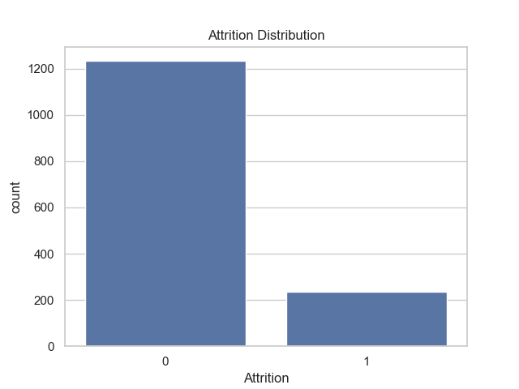

전체 이탈률은 약 **16%** 수준으로 나타났습니다.

수치 자체만 보면 아주 높다고 보긴 어렵지만,  
특정 조건에서 이탈이 집중되는지 확인하는 것이 중요하다고 판단했습니다.

---

## 5. 📊 주요 요인 분석

---

### 5.1 초과 근무 (OverTime)

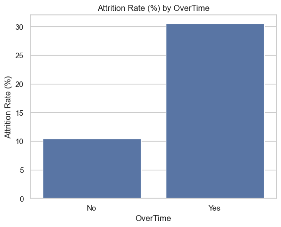

초과 근무 여부에 따라 이탈률 차이가 크게 나타났습니다.

- 초과 근무 O → 약 30%  
- 초과 근무 X → 약 10%  

👉 약 3배 차이

**해석**

초과 근무는 단순한 근무 시간 문제가 아니라,  
직원의 피로도와 워라밸에 직접적인 영향을 주는 요소입니다.

이 결과는 “업무량 관리가 곧 이탈 관리”라는 점을 보여준다고 생각합니다.

---

### 5.2 근속 연수

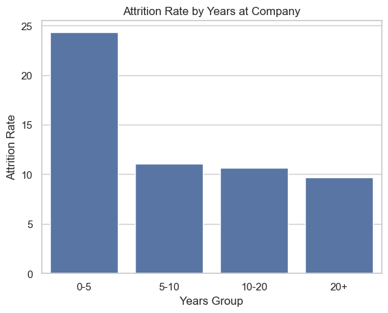  
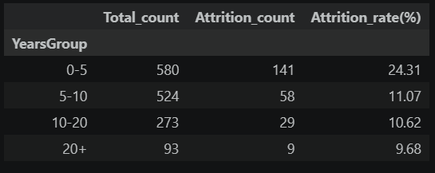

근속 연수별로 보면,  
**입사 초기(0~5년) 구간에서 이탈이 가장 높게 나타났습니다.**

**해석**

이 구간은  
- 조직 적응 단계  
- 직무 이해 단계  
- 기대와 현실이 부딪히는 시기  

라고 볼 수 있습니다.

결국 “처음 경험이 좋지 않으면 오래 남지 않는다”는 흐름으로 해석할 수 있습니다.

---

### 5.3 나이(세대)

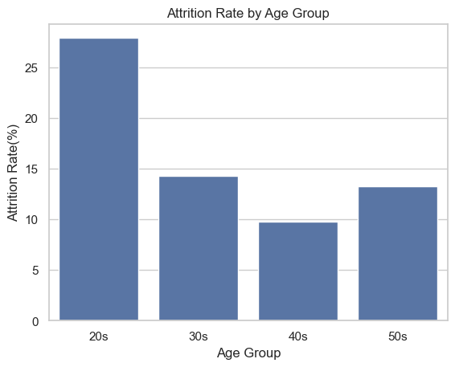  
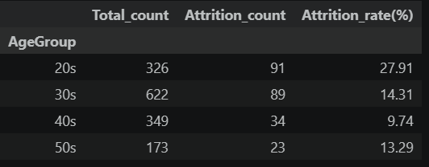

20대에서 가장 높은 이탈률이 나타났습니다.

**해석**

초기 커리어 단계에서는  
- 성장 기회  
- 보상 수준  
- 조직 문화  

에 대한 기대가 높기 때문에,  
조금만 맞지 않아도 이탈로 이어질 가능성이 높다고 볼 수 있습니다.

---

### 5.4 부서별 차이

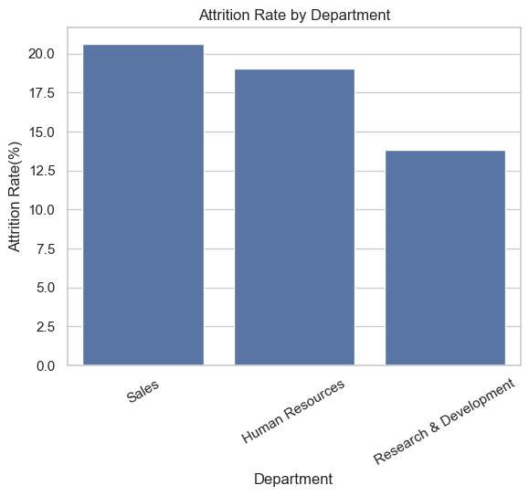  
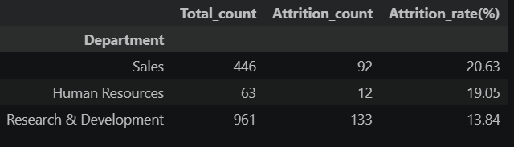

부서별로 이탈률 차이가 존재했습니다.

**해석**

이는 단순히 직무 차이보다는 업무 강도와 조직 환경의 차이에서 비롯된 것으로 해석할 수 있습니다.

---

### 5.5 연봉 & 직무 만족도

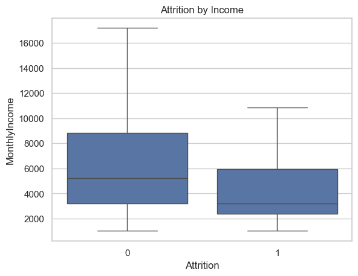  
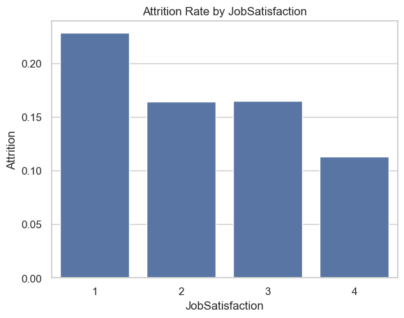
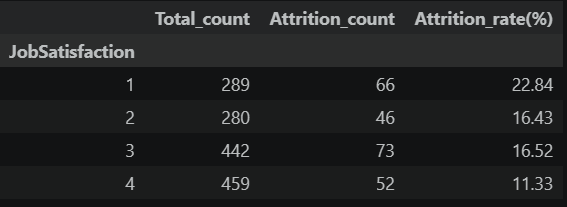

- 이탈자의 평균 연봉이 더 낮은 경향  
- 만족도가 낮을수록 이탈 증가  

**해석**

보상과 만족도는 “남을 이유”를 만들어주는 요소라고 볼 수 있습니다.

---

## 6. 🔥 교차 분석

---

### 6.1 나이 + 초과 근무

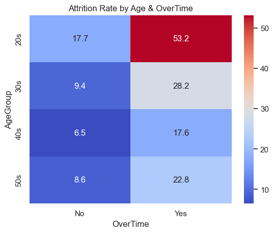  
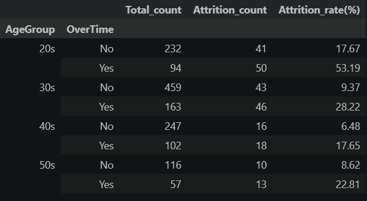

20대 + 초과 근무의 경우 이탈률이 **53%**까지 상승했습니다.

👉 단순한 증가가 아니라 “폭발적인 증가” 수준

---

### 6.2 근속 연수 + 초과 근무

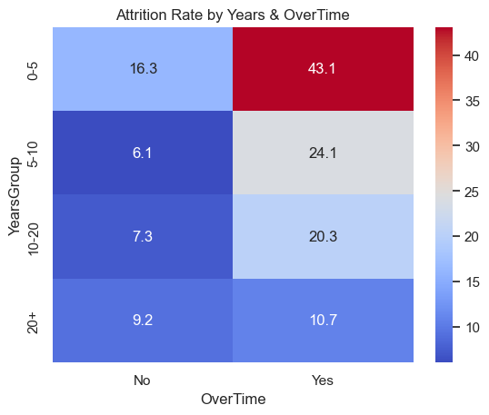  
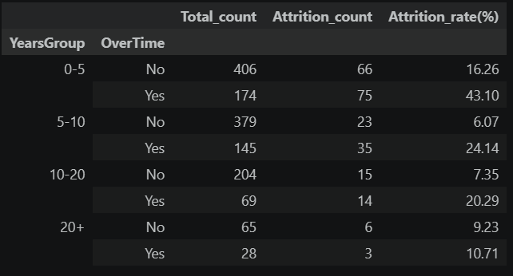

0~5년 + 초과 근무 → 43%

**해석**

👉 “처음부터 힘들면 떠난다”

이 한 문장으로 정리할 수 있는 결과입니다.

---

## 7. 🧠 핵심 인사이트

이 분석을 통해 느낀 핵심은 다음과 같습니다.

- 초기 직원에서 이탈이 집중된다  
- 초과 근무는 거의 모든 경우에서 영향을 준다  
- 젊은 직원일수록 이탈에 민감하다  
- 보상과 만족도는 이탈을 막는 핵심 요소다  

---

## 8. 🚀 HR 전략 제안

---

### 8.1 온보딩 경험 개선

초기 이탈을 줄이기 위해서는  
“잘 뽑는 것”보다 “잘 적응시키는 것”이 더 중요하다고 생각했습니다.

- 입사 후 1개월, 3개월, 6개월 시점에서 적응도 체크 
- 입사 후 3~6개월 동안 단계별 적응 프로그램 운영  
- 업무 난이도를 점진적으로 증가시키는 구조 설계  
- 멘토링 제도를 통해 심리적 안정감 제공  
- 정기적인 1:1 면담으로 적응 상태 확인  

👉 목표: “첫 경험을 좋게 만든다”

---

### 8.2 초과 근무 관리

데이터에서 가장 강하게 드러난 요인이기 때문에  
구조적인 관리가 필요합니다.

- 팀별 초과 근무 시간 모니터링  
- 주 단위 또는 월 단위 초과 근무 기준선을 설정하고, 초과 시 원인 분석 진행
- 일정 기준 초과 시 관리자 개입  
- 업무 분배 재조정  
- 반복 업무 자동화  

👉 목표: “지속 가능한 업무 환경 만들기”

---

### 8.3 젊은 직원 관리 전략

20~30대 직원은  
단순한 근무 조건보다 “성장 가능성”을 중요하게 생각합니다.

- 커리어 로드맵 제공  
- 직무 이동 기회 제공  
- 교육 및 자기계발 지원  
- 빠른 피드백 문화 구축  

👉 목표: “여기서 성장할 수 있다는 확신 제공”

---

### 8.4 보상 및 만족도 개선

- 시장 대비 연봉 수준 점검  
- 성과 기반 보상 강화  
- 복지 다양화  
- 직무 재설계  

👉 목표: “떠날 이유를 줄인다”

---

## 9. 📌 결론

이번 분석을 통해 느낀 점은 명확했습니다.

> 직원 이탈은 하나의 이유가 아니라, 여러 요인이 겹쳐서 발생한다는 것

특히,

> **“초기 직원 + 초과 근무”는 가장 위험한 조합**

이라고 판단했습니다.

이는 데이터 기반 HR 의사결정이 실제 조직 문제 해결에 어떻게 활용될 수 있는지를 보여준 사례라고 판단했습니다.

---

이 프로젝트를 통해  
데이터를 단순히 보는 것이 아니라,  
**조직의 문제를 이해하는 도구로 활용할 수 있다는 점을 경험할 수 있었습니다.**
